# Architecture Specification: Class Roles (クラス役割定義書)

## 1. 目的と役割 (Purpose and Roles)

本ドキュメントは、Gravity Freight の最終実装において必要となるクラスの役割（Roles）、責務の境界、およびその生存期間（Lifecycle）を定義する。
設計原理（階層性、単純性、明晰性）に基づき、各クラスの責任を分離することで、拡張性が高くデバッグの容易なアーキテクチャを実現することを目的とする。

---

## 2. システム構造図 (System Hierarchy)

Gravity Freight は、`AppOrchestrator` をルートとした階層構造を採用している。上位レイヤーが下位レイヤーを所有し、そのライフサイクルと依存関係を管理する。

```mermaid
graph TD
    %% Root Layer
    Orchestrator["AppOrchestrator (Root)"]

    %% Control Layer
    Orchestrator --> UI["UIController (UI/Input)"]
    UI --> BPV["BuildPanelView (Build Panel)"]
    UI --> FRSV["FlightResultScreenView (Flight Result)"]
    UI --> ADV["ArchiveDialogView (Archive Dialog)"]
    UI --> AMV["AppMetadataView (App Metadata)"]
    UI --> SDV["SettingsDialogView (Settings Dialog)"]
    UI --> MIC["MapInputController (Canvas Input)"]
    UI --> SIP["StarInfoPanel (Hover Items)"]
    Orchestrator --> HTP["HowToPlayUI (Manual Screen)"]
    HTP --> HTD["HowToPlayDiagrams (Manual Demos)"]
    Orchestrator --> GDR["GameDataRepository (Data Access)"]

    %% Logic & System Layer
    Orchestrator --> GC["GameController (Game Flow/Logic)"]
    Orchestrator --> ASP["ArchiveScreenPresenter"]
    GC --> BFC["BuildFlowController"]
    GC --> BSP["BuildScreenPresenter"]
    GC --> FFC["FacilityFlowController"]
    GC --> MICL["MapInteractionController"]
    GC --> SPC["SectorProgressionController"]
    GC --> NLC["NavigationLoopController"]
    GC --> SS["SessionState (Current Game State)"]
    SS --> IC["ItemContainer (Inventory)"]
    SPC --> SEC["Sector (Current Map)"]
    SEC --> ES["EconomySystem (Lottery/Price)"]

    %% System Layer (Infrastructure)
    Orchestrator --> WR["WorldRenderer (Rendering)"]
    WR --> BM["BackgroundManager (Stars)"]
    Orchestrator --> TSA["TitleScreenAnimator (Title Visuals)"]
    TSA --> BM
    WR --> CC["CameraController (View/Matrix)"]
    WR --> SMR["SectorMapRenderer (Map Objects)"]
    WR --> FVR["FlightVisualRenderer (Flight Visuals)"]
    WR --> CCP["CanvasColorPalette (CSS Token Colors)"]
    BM --> CCP
    Orchestrator --> SC["SoundController (Audio)"]

    %% Global Services
    Orchestrator --> AT["AchievementTracker"]
    Orchestrator --> GRT["GameRecordTracker"]
    Orchestrator --> RT["RankTracker"]
    Orchestrator --> FR["FlightRecorder"]
    Orchestrator --> Story["StorySystem"]
    Orchestrator --> PE["PhysicsEngine"]
    Orchestrator --> TP["TrajectoryPredictor"]

    %% Key Cross-domain relations (Dashed lines)
    TP -.->|Use| PE
    NLC -.->|Use| PE
    UI -.->|Reference| CC
    WR -.->|Sync| CC
```

---

## 3. 生存期間の定義 (Lifecycle Definitions)

システム内でのオブジェクトのライフサイクルを以下の4段階に定義し、データの永続性とリセットの境界を明確にする。

| 区分 | 説明 | リセットタイミング |
| :--- | :--- | :--- |
| App Lifecycle | ゲームの起動から終了まで。マスタデータや設定など、プレイを跨いで共通の要素。 | アプリ終了時 |
| Game Lifecycle | 契約の開始（Begin Contract）から、終了（End Contract / Game Over）まで。1回のプレイセッションの状態。 | Titleへ戻る / Game Over時 |
| Stage Lifecycle | セクター（ステージ）への入場から、クリアして次のセクターへ移動するまで。失敗時の再試行ではリセットされない。 | セクタークリア（次へ移動）時 |
| Flight Lifecycle | 1回のビルド準備から、航行および結果（Success, Crashed等）が確定するまで。 | リザルト確認 / Buildingへ戻る時 |

---

## 4. ドメイン別役割定義 (Domain Role Documents)

本ドキュメントは全体構造とライフサイクルの定義に限定する。各クラスの詳細な役割と責務境界は、ドメインごとに以下へ分割する。

- [World / Entity Domain Roles](./class_roles_world_entities.md)
    - Sector, CelestialBody, ExitArc, Item, Rocket, SessionState など、ワールド構造とプレイヤー資産を扱うクラス。
- [Logic Domain Roles](./class_roles_logic.md)
    - 物理、航行、経済、施設、記録、実績、ストーリーなど、ゲームルールを実行するクラス。
- [Infrastructure / UI Domain Roles](./class_roles_infrastructure.md)
    - アプリ起動、データアクセス、UI、描画、入力、音響など、アプリ基盤を構成するクラス。
