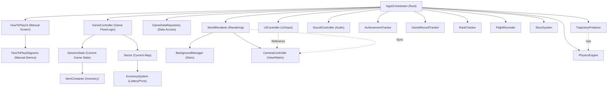

# Architecture Specification: Class Roles (クラス役割定義書)

## 1. 目的と役割 (Purpose and Roles)

本ドキュメントは、Gravity Freight V2 の最終実装において必要となるクラスの役割（Roles）、責務の境界、およびその生存期間（Lifecycle）を定義する。
設計原理（階層性、単純性、明晰性）に基づき、各クラスの責任を分離することで、拡張性が高くデバッグの容易なアーキテクチャを実現することを目的とする。

---

## 2. システム構造図 (System Hierarchy)

Gravity Freight V2 は、`AppOrchestrator` をルートとした階層構造を採用している。上位レイヤーが下位レイヤーを所有し、そのライフサイクルと依存関係を管理する。

---

## 3. 生存期間の定義 (Lifecycle Definitions)

システム内でのオブジェクトのライフサイクルを以下の4段階に定義し、データの永続性とリセットの境界を明確にする。

| 区分 | 説明 | リセットタイミング |
| :--- | :--- | :--- |
| App Lifecycle | ゲームの起動から終了まで。マスタデータや設定など、プレイを跨いで共通の要素。 | アプリ終了時 |
| Game Lifecycle | 契約の開始（Begin Contract）から、終了（End Contract / Game Over）まで。1回のプレイセッションの状態。 | Titleへ戻る / Game Over時 |
| Stage Lifecycle | セクター（ステージ）への入場から、クリアして次のセクターへ移動するまで。失敗時の再試行ではリセットされない。 | セクタークリア（次へ移動）時 |
| Flight Lifecycle | 1回のビルド準備から、航行および結果（Success, Crashed等）が確定するまで。 | リザルト確認 / Buildingへ戻る時 |

---

## 4. ワールドドメイン (World Domain)

宇宙空間を構成する、主に静的・準静的な物理要素。

- **Sector**
    - 生存期間: Stage Lifecycle
    - 役割: 航行セッションの環境定義とコンテナ。
    - 責務:
        - セクター内に配置される `CelestialBody`（天体）および `ExitArc`（出口）のリストの保持。
        - セクター境界（Boundary Radius）および帰還ボーナスの保持。
        - セクター全体の完全なスナップショットの生成と提供。
- **CelestialBody (GravitySource)**
    - 生存期間: Stage Lifecycle
    - 役割: 物理的な天体オブジェクト。
    - 責務: 重力場の提供、衝突判定用ジオメトリ、保持アイテムの管理。
- **ExitArc (Goal)**
    - 生存期間: Stage Lifecycle
    - 役割: 航行の目的地。
    - 責務: 配置位置（ゴールの中心角度）とゴール判定用の角度範囲（Angle Range）、および施設タイプの保持。

---

## 5. エンティティドメイン (Entity Domain)

ゲーム内の主要なアクター、およびプレイヤーの資産データ。

- **RocketItem** (extends Item)
    - 生存期間: Exist Lifecycle
    - 役割: パーツ構成や基本性能（質量など）を保持するインベントリアイテム。
    - 責務: 内部パーツ構成に基づいた集計性能（mass, slots 等）の算出。
- **Rocket**
    - 生存期間: Flight Lifecycle
    - 役割: 照準・航行中の物理実体。
    - 責務:
        - **コンテキスト保持**: `RocketItem`, `Launcher`, `Booster` への参照、および射出角度（angle）の保持。
        - **物理パラメータの算出**: 自身のアイテム構成と角度に基づいた「初速ベクトル（Initial Velocity）」の自己算出。
        - **動的状態の管理**: 自身の物理状態（位置、速度、回転）の保持。
        - **自己更新と集計 (`updateState`)**: 物理エンジンから通知された新しい状態を適用し、同時に航跡データ（`actualTrail`）への追加と航行ティック数（スコア）のインクリメントを自律的に行う。
        - **成果の集計（Result Carrier）**: 航行中に獲得したスコア、所持コインの増分、回収した貨物（Cargo）、および保持状態の全アイテムを蓄積し、リザルト画面に提供する。
- **Item**
    - 生存期間: Exist Lifecycle
    - 役割: ゲーム内の全アイテムの基底。
    - 責務: 個別の属性（ID、現在耐久値、強化状態）の保持。
- **StackedItem**
    - 生存期間: Exist Lifecycle
    - 役割: 同一 ID かつ **「同一性能」** のアイテムを個数で管理する実体。
    - 責務: インベントリ内でのスタック管理、UI 表示（代表値の返却）の提供。
- **ModuleStack**
    - 生存期間: Exist Lifecycle
    - 役割: ロケット内部で、同一 ID のアイテムを **「機能プール」** として一括管理する実体。
    - 責務: 異なる性能のアイテムを統合した合計耐久度の管理、および消費戦略（LIFO/FIFO等）に基づく耐久度減算。
- **ItemContainer**
    - 生存期間: Exist Lifecycle
    - 役割: プレイヤーの所持品（StackedItem）を管理するインベントリの実体。
    - 責務: カテゴリ別抽出、スタック単位の検索、およびアイテムの入出庫（addItem/pop）の提供。
- **SessionState**
    - 生存期間: Game Lifecycle
    - 役割: 現在の契約（Contract）における動的ステータスの集約・保持。
    - 責務: 所持金（Coins）、累計スコア、現在のセクター番号、獲得ストーリーID、統計データの保持。およびプレイヤー全体所持品（ItemContainer）の管理。

---

## 6. ロジックドメイン (Logic Domain)

ゲームの物理・経済・進行などの「ルール」を実行するステートレスなサービス。

- **PhysicsEngine**
    - 生存期間: App Lifecycle (Service)
    - 役割: 物理シミュレーター。
    - 責務:
        - ティック単位の積分計算、全天体からの重力合算。
        - 算出された新しい物理状態（位置・速度）を `Rocket` に通知し、`rocket.updateState()` を実行させる。
- **TrajectoryPredictor**
    - 生存期間: App Lifecycle (Service)
    - 役割: 軌道予測機。
    - 責務:
        - 未来の航跡計算。
        - `Rocket` のクローンを作成し、`PhysicsEngine` を用いて指定ティック分ループ実行することでシミュレーションを行う。
        - **計算完了後の `Rocket` クローンを返す**。このクローンが持つ `actualTrail`（移動履歴）が、UI 上での「予測軌道」として利用される。
- **EconomySystem**
    - 生存期間: App Lifecycle (Service)
    - 役割: 経済・取引・抽選ロジックの外部窓口。
    - 責務:
        - セクター内のアイテム出現・抽選（マップ配置）の制御。
        - 航行結果精算、交易所在庫、共通価格計算を内部サービスへ委譲する。
        - 航行結果確定後および施設退出時に共通利用するゲームオーバー判定。
- **SettlementCalculator**
    - 生存期間: App Lifecycle (Service)
    - 役割: 航行終了時精算ロジック。
    - 責務:
        - 衝突結果と `FlightResultData` から `SettlementResult` を生成する。
        - 配送、拾得コイン、施設報酬、保険金、遺失物、割引率を集計する。
- **PricingService**
    - 生存期間: App Lifecycle (Service)
    - 役割: 共通価格計算。
    - 責務:
        - 共通割引ルール、修理費、解体費を計算する。
        - アイテム自身が算出する査定額に対し、施設横断の価格補正を適用する。
- **TradingPostService**
    - 生存期間: App Lifecycle (Service)
    - 役割: Trading Post 取引準備。
    - 責務:
        - 交易所在庫を生成し、特売品を設定する。
        - アイテム抽選は `EconomySystem.drawLottery()` へ委譲する。
- **BlackMarketService**
    - 生存期間: App Lifecycle (Service)
    - 役割: Black Market ガチャ取引準備。
    - 責務:
        - 100c / 500c の排出ライン、抽選補正、確率エンチャントを適用してガチャ結果を生成する。
        - アイテム抽選は `EconomySystem.drawLottery()` へ委譲する。
        - 所持金や inventory は直接変更せず、`SessionState.applyTransaction()` 用の `TransactionResult` を返す。
- **RepairDockService**
    - 生存期間: App Lifecycle (Service)
    - 役割: Repair Dock 取引準備。
    - 責務:
        - 発射台修理、ロケット解体・強化の `TransactionResult` を生成する。
        - 支払い、対象 item の存在確認、inventory 反映は `SessionState.applyTransaction()` へ委譲する。
        - 修理・強化の施設固有処理は、支払い成功後に実行される `onCommit` callback として定義する。
- **GameController**
    - 生存期間: Game Lifecycle
    - 役割: ゲーム進行・シーン管理。
    - 責務:
        - プレイ中（ワープ〜航行〜リザルト〜施設〜ゲーム終了）の一連の画面遷移とロジックの統括。
        - SessionState のセクター番号更新、Sector の生成・破棄管理。
        - 航行中の物理計算、スコア計算、終了判定の実行。
        - ゲームリザルト表示時点で記録値・実績・ランキング確定処理を呼び出す。
- **StorySystem**
    - 生存期間: App Lifecycle (Service)
    - 役割: 物語（Story）の選択・永続進捗管理。
    - 責務:
        - ストーリーIDごとの永続的な既読状態（isRead）の管理。
        - 条件に応じたストーリーIDの選出。
        - 既読フラグの更新と永続化。
- **AchievementTracker**
    - 生存期間: App Lifecycle
    - 役割: 実績管理。
    - 責務: 実績定義と `GameRecordTracker` の記録値を照合し、実績の達成状況と進捗を算出する。
- **GameRecordTracker**
    - 生存期間: App Lifecycle
    - 役割: ゲーム全体の記録値管理。
    - 責務: 契約終了時の `GameResultSummary` から、実績判定や Analytics のサイドKPIが参照する累計値・最大値などを保持する。
- **RankTracker**
    - 生存期間: App Lifecycle
    - 役割: ランキング管理。
    - 責務: ゲーム1プレイ単位の結果をもとに、スコア・到達セクター・回収数などの上位記録を保持する。
- **FlightRecorder**
    - 生存期間: App Lifecycle
    - 役割: 航行記録・リプレイ管理。
    - 責務:
        - 発射時点の航行初期状態 snapshot を一時記憶する。
        - 航行終了時メタ情報と結合して航行記録候補を確定する。
        - 保存対象となった航行記録を永続化し、リプレイ再生時に初期状態を復元する。

---

## 7. システムドメイン (System Domain)

描画、入力、全体制御などのインフラストラクチャ。

- **AppOrchestrator**
    - 生存期間: App Lifecycle
    - 役割: アプリ基盤保持・全体指揮。
    - 責務:
        - アプリ共通のインフラクラスの保持と初期化。
        - タイトル画面の管理と、ゲーム本編（GameController）の起動。
- **GameDataRepository**
    - 生存期間: App Lifecycle
    - 役割: GravityFreight のデータアクセス統合窓口。
    - 責務:
        - 静的なゲームマスタデータをロードし、各クラスへ提供する。
        - ユーザーデータを共通 DataManager の `getSavedData` / `setSavedData` で読み書きする。
        - 各クラスが共通 DataManager や `localStorage` へ直接依存しないようにする。
- **UIController**
    - 生存期間: App Lifecycle
    - 役割: 表示管理。
    - 責務:
        - 画面遷移、ダイアログ表示の制御。
        - HUDの制御。
        - UI 操作イベントをアプリ側のハンドラへ中継する。
- **HowToPlayUI**
    - 生存期間: App Lifecycle
    - 役割: 説明書画面コントローラー。
    - 責務:
        - How To Play 画面の表示、非表示、ページ遷移を制御する。
        - `GameDataRepository` から取得した説明書コンテンツを描画する。
        - 説明書内デモの開始と停止を `HowToPlayDiagrams` へ委譲する。
- **HowToPlayDiagrams**
    - 生存期間: App Lifecycle
    - 役割: 説明書内デモ描画。
    - 責務:
        - How To Play 画面内のカード選択デモと canvas アニメーションを管理する。
        - 実ゲーム状態を変更せず、説明用サンプル状態だけで演出を完結させる。
        - ページ移動や画面非表示時に、実行中の timer / animation frame を停止する。
- **BackgroundManager**
    - 生存期間: App Lifecycle
    - 役割: 遠景演出管理。
    - 責務: Starfield の生成、ワープ演出の制御。
- **SoundController**
    - 生存期間: App Lifecycle
    - 役割: 音響演出管理。
    - 責務: SE（効果音）および BGM の再生、ボリューム設定の管理。
- **WorldRenderer**
    - 生存期間: App Lifecycle
    - 役割: ワールド（Canvas）描画エンジン。
    - 責務: Canvas上における各要素（天体、ロケット、軌道等）の描画順序の制御、および描画ループの実行。
- **CameraController**
    - 生存期間: App Lifecycle
    - 役割: 視界管理。
    - 責務: ズーム、パン、座標変換。
